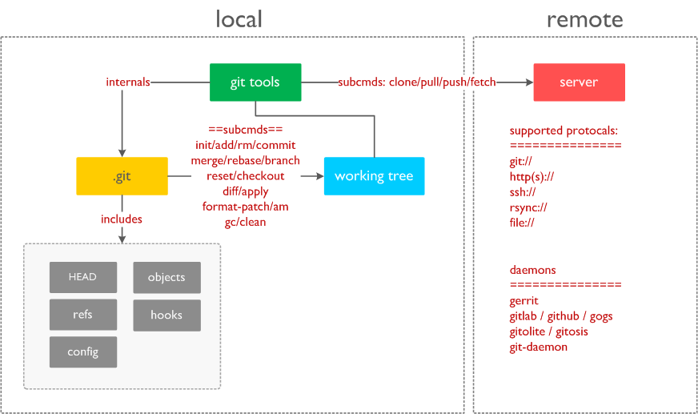

## 整体架构

整体结构图:


## 内部对象
- blob：用于存储具体文件内容，是压缩了之后的；

```
# blob文件结构
--------------------------------------
实际文件内容
--------------------------------------
```

- commit：用于存储用户提交的commit信息

```
# commit文件结构
--------------------------------------
tree $tree_hash
parent $parent_hash
....(多个)
parent $parent_hash
author $auth_name <$email>
committer $commiter_name <$commiter_email>

$comments
--------------------------------------
```

- tree：分目录存放目录下的文件名、mode信息，以及对应版本的blob对象的hash值。

```
# tree对象文件结构
--------------------------------------
[octal file mode]+[space]+[filename+'\0']+[SHA1(20bytes)];
......
[octal file mode]+[space]+[filename+'\0']+[SHA1(20bytes)];
--------------------------------------
```

- tag：记录tag的信息

```
# tag文件结构
--------------------------------------
object $hash
type xxx
tag $tag_name
$comments
$gpg_value
--------------------------------------
```
git会为每个新提交或者修改的blob对象生成一个新的hash，blob对象内容存储在以这个新的hash值命名的文件中（用zlib压缩后存储），同时生成一个新的tree对象，将新的blob对象的hash值存到新的tree对象中，tree对象的内容存放在以新的内容生成的hash命名的文件中（同样是经过zlib压缩后的），然后再为新的tree对象生成一个commit对象，新的commit对象的内容包括：新生成的tree对象的hash，父commit对象的hash，提交的描述信息，提交人以及日期等信息，然后新的commit对象依然存储在以hash值命名的文件中（经过zlib压缩后）。整个git仓的最新的commit对象的hash值存放在 .git/HEAD文件中。这样通过HEAD文件，就可以把整个git提交记录和历史版本找到了。

## 底层命令

reference: Documentation/git.txt

- hash-object: 获取输入对象的hash值
- cat-file: 查看一个给定hash值得object内容、大小、类型等信息
- update-index: 更新一个文件到index暂存区中，并且将文件内容写入新的.git/objects/??/xxxx文件中
- write-tree: 将暂存区的内容写入一个/多个树对象
- read-tree: 将树对象读取到暂存区中
- commit-tree: 创建一个提交对象，并且需要为该commit对象提供一个树对象的hash值
- verify-pack: 查看打包内容信息
- diff-files: 查看暂存区和工作区之间的差异
- diff-index:


## merge策略

### resolve

对两个head执行一次三方合并操作

### recursive

对两个head执行一次三方合并，但和resolve不同的是，当两个head有不止一个共同的祖先节点，它将为所有的共同祖先节点创建一个merged tree，并用来作为三方合并的参考。是默认的pull and merge策略

### octopus

多方合并策略（用于head数多于2个的情况）

### ours


## 情景分析
- git init
    - 创建.git目录
    - 拷贝template文件和目录到.git/目录下，这里用户可以通过 --template设置一个模板目录，或者从系统默认的/usr/share/git-core/templates/中拷贝文件到 .git/ 目录下
    - 拷贝默认配置
    - 创建refs/heads, refs/tags目录，创建refs/HEAD文件，指向refs/heads/master

- git clone
    - 支持的协议: http, rsync, git, ssh, file://


- git add 

```
------------------------------------------------
$ git-update-index --add hello example
------------------------------------------------
```

- git commit

```
------------------------------------------------
$ tree=$(git-write-tree)
$ commit=$(echo 'Initial commit' | git-commit-tree $tree)
$ git-update-ref HEAD $commit
------------------------------------------------
```

- git push 
- git log
- git status
- git gc
- git rebase master feature_branch
    - 切换到feature_branch分支
    - reset --hard到master最后一个commit
    - format-patch：从master到feature_branch最后一个提交
    - am patch到master

*rebase后，可以使用`git push origin feature_branch:master`把rebase后的内容push到远端服务器，然后pull到本地后，就可以删除本地的feature_branch，从而完成feature的开发；*

- git merge
- git pull 

- git reset

```
--soft:
    index不变, working tree不变，将状态设置为to be committed状态
--mixed:
    index被更新为和repo一样，working tree不变
--hard:
    index和working tree同时更新为和repo一致
```


## 示例

- 可以通过git log查看提交的commit对象信息
- 根据commit对象的hash值，通过git cat-file -p $hash可以找到对应的tree对象的hash
- 根据tree对象的hash值，通过git cat-file -p $hash可以每个blob对象的hash
- 根据blob对象的hash值，通过git cat-file -p $hash可以查看某个版本的blob对象的内容

```
:> git cat-file -p 298976815a71d3b7b5ec0dd96188cd42300c2592
tree 62f831c1208f89fccff48bb6246f91a486442212
parent 46b0d46647c71130b338ec25cbec2601c298037b
author wangyu10 <wangyu10@le.com> 1490586125 +0800
committer wangyu10 <wangyu10@le.com> 1490586125 +0800

add NOT
:> git cat-file -p 46b0d46647c71130b338ec25cbec2601c298037b
tree 021d1cf8e0498b2eca5f4d4624e715e18904513c
author wangyu10 <wangyu10@le.com> 1490585986 +0800
committer wangyu10 <wangyu10@le.com> 1490585986 +0800

add v1.txt

:> git cat-file -p 021d1cf8e0498b2eca5f4d4624e715e18904513c
100644 blob d86bac9de59abcc26bc7956c1e842237c7581859  v1.txt

:> git cat-file -p d86bac9de59abcc26bc7956c1e842237c7581859
OK

```

对象查找过程：commit对象 => tree对象 => blob对象

注：在commit对象中可以通过parent来跟踪提交历史信息(parent指向了父commit对象的hash)


## 目录结构

reference: Documentation/repository-layout.txt

```
├── HEAD    # 当前分支的头指针hash或者参考
├── config  # 本地配置         
├── description
├── hooks
│   ├── applypatch-msg.sample
│   ├── commit-msg.sample
│   ├── post-update.sample
│   ├── pre-applypatch.sample
│   ├── pre-commit.sample
│   ├── pre-push.sample
│   ├── pre-rebase.sample
│   ├── pre-receive.sample
│   ├── prepare-commit-msg.sample
│   └── update.sample
├── info
│   └── exclude
├── objects
│   ├── info
│   └── pack
└── refs
    ├── heads  #存放各个分支的最新commit对象对应的hash
    └── tags   #存放tag对象对应的hash
```

## 技术点滴

- refs类型

```
# sha1
------------------
0123456789abcdefabcd0123456789abcdefabcd
------------------

# symbolic ref
------------------
refs: refs/heads/master
------------------

# ^符号
------------------
rev^n 在rev直接父节点中选择第n个，因为一个rev可以有多个父节点，例如在进行merge的时候
------------------

# ~符号
------------------
rev~n 表示rev的前向第n层父节点，是层次结构上的父节点，而不是同一层的父节点。
------------------

例子：
========================================
    G   H   I   J
     \ /     \ /
      D   E   F
       \  |  /
        \ | /
         \|/
          B     C
           \   /
            \ /
             A

    A =      = A^0
    B = A^   = A^1     = A~1
    C = A^2  = A^2
    D = A^^  = A^1^1   = A~2
    E = B^2  = A^^2
    F = B^3  = A^^3
    G = A^^^ = A^1^1^1 = A~3
    H = D^2  = B^^2    = A^^^2  = A~2^2
    I = F^   = B^3^    = A^^3^
    J = F^2  = B^3^2   = A^^3^2

==========================================
```


## 疑问

- **git-diff-*的功能差异**

```
                      diff-tree
                       +----+
                       |    |
                       |    |
                       V    V
                    +-----------+
                    | Object DB |
                    |  Backing  |
                    |   Store   |
                    +-----------+
                      ^    ^
                      |    |
                      |    |  diff-index --cached
                      |    |
          diff-index  |    V
                      |  +-----------+
                      |  |   Index   |
                      |  |  "cache"  |
                      |  +-----------+
                      |    ^
                      |    |
                      |    |  diff-files
                      |    |
                      V    V
                    +-----------+
                    |  Working  |
                    | Directory |
                    +-----------+
```

- **xxxxx.idx文件结构**

```
struct pack_idx {
    unsigned int offset;    //每个sha1 object对象在pack文件中的偏移
    unsigned char sha1[20]; //sha1 object对象的sha1值;
}

unsigned int offset[256];   //每个sha1首字符分段在idx文件中的偏移，总共有256个段（8bit总共256中可能）
struct pack_idx pkt[N];      

```

- **xxxxx.pack文件结构**

```
参考代码：unpack-objects.c
struct pack_header {
    unsigned int hdr_signature;
    unsigned int hdr_version;
    unsigned int hdr_entries;
};
============================================
=            pack_header                   =
============================================
## for non-delta type: commit, tree, blob, tag
type | size1
size x N                          ## N <= 4
unsigned char data[size];
--------------------------------------------
## for delta type
type | size1
size x N                          ## N <= 4
unsigned char base_sha1[20];
unsigned char data[size];
============================================
```


- **如何查找两个commit节点的最新公共父节点？**

- **如何merge一个分支到另外一个分支上去？**

**决策过程**：

    - Fastword：当HEAD是需要merge的分支的首个祖先节点时进行这个操作
    - Do nothing：当HEAD和需要合并的分支的节点是同一个节点时；
    - trivial merge：当只需要merge一个分支，并且不属于上述两种情况的时候
        - trivial merge失败后，则需要进行一次真正的merge，需要根据策略调用不同的merge子程序来进行merge操作（最终使用的rcs的merge程序来进行的）
    - octopus：当输入的合并分支数**大于1个**的时候，需要进行此项合并；

**合并策略**：

根据用户输入(-s $strategy)，可以有四中不同的策略模式：recursive, resolve, ours, octopus;

**合并**：

一个典型的merge操作需要进行如下的步骤

    * 找到HEAD和target的共同祖先节点
    * 调用merge程序进行merge操作，需要传递祖先文件内容，HEAD文件内容以及target版本文件内容
    * 根据操作结果进行如下操作：
        * 成功：
        * 失败：


- **fast-foward是怎么回事，什么情况下要避免使用？**

- **什么情况下一个commit对象有两个parent？**

执行git merge的情况下，会为新生成的commit对象指定两个父commit，示例如下：

```
git cat-file -p a471df0501299bb6caac6d895967429056e62c6e
tree 84628bcd1b701edb5cbc1f351de604782c2bd117
parent 7307f4d9ce64a9d78f6925b095b9084f88b7231c
parent 6915d19774e6999624e01dd4d04aa67d1c546fab
author xxx <xxx@xxx.com> 1492584515 +0800
committer xxx <xxx@xxx.com> 1492584515 +0800
```

git merge后会生成新的commit对象、tree对象、blob对象。git merge后看到的log是按照时间顺序的，是因为在git log输出的时候，做了按时间排序的处理，其实merge并没有对原来的数据提交记录进行更改，只是增加了新的commit、tree、blob对象而已，原来分支上的这些对象也都还在。这个可以通过git cat-file -p打印来验证。
