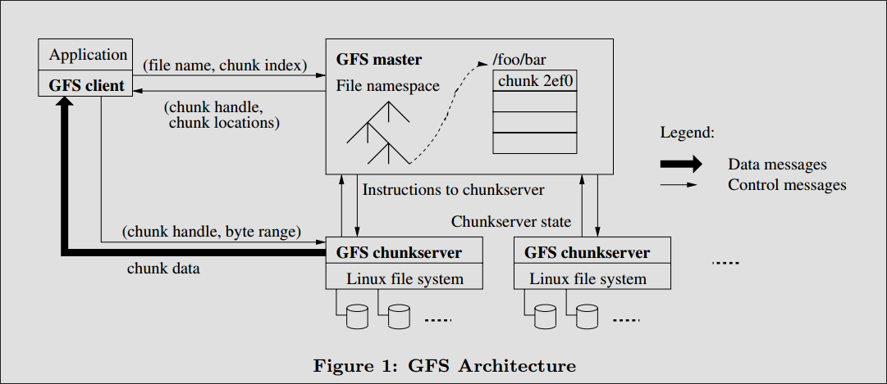

## GFS

- 包含一个master和多个chunkserver
- master存储元数据，负责文件到数据的映射，chunkserver负责数据的存储
- client代码给编译连接到app中，负责和master交互，但是数据的读写则直接和chunkserver进行通讯
- master和chunkserver之间通过心跳消息进行可用性检查。
- 每个文件在不同的chunkserver中有三个备份，以保证数据可恢复
- 对于元数据：
    * 文件和chunk的名字空间、文件到chunk的映射关系存储在master本地，并通过log信息同步给远端主机，以此提升恢复能力；
    * 每个chunk副本的位置信息则存储在chunkserver上，每次master启动的时候或者chunkserver启动的时候动态查询到，并在master的内存中保留一份，不在master上做持久化；
- 为了缩短灾难恢复的时间，GFS会通过operation log来本地恢复元数据信息，并对operation log设置多个checkpoint，恢复时可以从上一个checkpoint开始replay operation log内容，从而达到恢复数据的目的；
- master也有replication，当一个master失效后，系统监控进程会使另外一个replication变为master；
- GFS通过为每个chunk设置一个version number的方式来检查数据是否已经过期，这样可以防止一个chunkserver失效后，恢复，返回给client已经过期的数据；
- master会负责在不同的chunkserver上做数据的均衡排布，以保证负载均衡的分布到不同的server上
- 数据完整性：通过checksum来检查数据是否已经被损坏，通过version number来检查数据是否已经过期

### 疑问

- 假设一台chunkserver失效了，什么机制会触发这台机器上的数据被复制到别的机器上去？复制的过程是什么？

心跳检测机制检查来检查是否chunkserver已经失效，利用rebalancing机制来平衡各个chunkserver之间的负载； 
另外当一个chunk数据块被损坏后，会将返回error给client，并同时发送消息给master，通知其在其它机器上进行replicate。

## Bigtable

## Mapreduce

