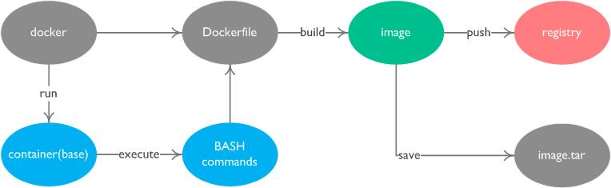

# overview

This doc shows how to share a developing environment within a team or a company.



## STEP: install

install docker-ce on ubuntu16.04

```
## remove old versions if existed
sudo apt-get remove docker docker-engine docker.io

## install dependency
sudo apt-get update
sudo apt-get install apt-transport-https  ca-certificates  curl  software-properties-common

## add GPG key
curl -fsSL https://download.docker.com/linux/ubuntu/gpg | sudo apt-key add -
curl -fsSL https://mirrors.ustc.edu.cn/docker-ce/linux/ubuntu/gpg | sudo apt-key add -

## add repository
sudo add-apt-repository \
   "deb [arch=amd64] https://download.docker.com/linux/ubuntu \
   $(lsb_release -cs) \
   stable"

sudo add-apt-repository \
    "deb [arch=amd64] https://mirrors.ustc.edu.cn/docker-ce/linux/ubuntu \
    $(lsb_release -cs) \
    stable"

sudo apt-get update

## install docker-ce
sudo apt-get install docker-ce
sudo usermod -aG docker $USER

## then relogin or reboot

## check
sudo docker run hello-world

```

## STEP: change docker image mirror

```
##centos/redhat: /etc/sysconfig/docker
other_args=--registry-mirror=https://registry.docker-cn.com

##ubuntu16.04: /etc/docker/daemon.json
{
  "registry-mirrors": ["https://registry.docker-cn.com"]
}

sudo systemctl daemon-reload
sudo systemctl restart docker

```

## STEP: Write a Dockerfile

```
## Write your own Dockerfile
##
## FROM ubuntu:16.04
## RUN apt-get update \
##     && apt-get install -y xxx
##
## ENTRYPOINT ["/bin/bash"]
##

```

## STEP: Build a image

```
docker build -t imgname:tag .
```

## STEP: Share it

- Share with Dockerfile
- Share with tar file

```
docker save xxx -o xxx.tar
docker load < xxx.tar
docker tag xxx new-xxx
```

- Upload to a local registry

```
docker tag xxx 10.100.50.120:5000/xxx
docker push 10.100.50.120:5000/xxx
```

## STEP: Get it

- Copy Dockerfile from others

```shell
## build images
cp Dockerfile workspace/ && cd workspace
docker build -t imgname:tag .

## check
docker images

```

- Import a tar file from others

```
cp env.tar workspace/ && cd workspace/
docker load < xxx.tar
docker tag xxx dev
```

- Pull image from local registry

```
docker pull 10.100.50.120:5000/xxx
```

## STEP: Start a container

```shell

## run a new container
docker run -it -P --name dev img:tag /bin/bash

## start a exited container
docker start dev

```

## STEP: Enter&Play a container

```shell

## attach to a container dev
docker attach dev

## use nsenter
denter() {
    #docker run -it --name wrtc -P ubuntu:16.04 /bin/bash
    _pid=`docker inspect -f {{.State.Pid}} $1`
    HOME=/root LANG=en_US.UTF-8 LANGUAGE=en_US:en sudo nsenter --mount --uts --ipc --net --pid -w --target $_pid
}
denter dev
```

> When you attach a container twice, play a command in one side, it will play it in the other side too. It is not so conventinent when you want to enter different directory. When you are in this situation, you can use the customized command `denter`.

## STEP: Leave a container

```shell
## detach container
ctrl+p+q

## leave ns
ctrl+d

```

# Setup a local registry

```shell
## get registry image
docker pull registry
docker images

## start registry
docker run -d -p 5000:5000 -v /home/docker:/var/lib/registry registry

## push local image to registry
docker tag xxx 127.0.0.1:5000/xxx
docker push 127.0.0.1:5000/xxx

## check registry
curl http://10.1.250.214:5000/v2/_catalog
curl http://10.1.250.214:5000/v2/<name>/tags/list

## pull it on other machine
echo '{ "insecure-registries":["10.1.250.214:5000"] }' | sudo tee /etc/docker/daemon.json
sudo service docker restart
docker pull x.x.x.x:5000/xxx

## delete a image on local registry
curl -X DELETE http://10.1.250.214:5000/v2/<name>/manifests/<reference>

```

# Commands

## image releated

```shell
docker images             ## list images
docker rmi                ## remove a image
docker build              ## build a image from a dockerfile
docker export             ## export a container to a tar file
docker import             ## import a image from a tar file
docker commit             ## commit the change from a container
docker tag                ## rename a image
docker save -o xxx.tar    ## save a image to a tar file
docker load < xxx.tar     ## load image from a tar file

```

## container releated

```shell
docker ps          ## list container
docker rm          ## remove a container
docker start       ## start a exited container
docker stop        ## stop a running container
docker attach      ## attach to a running container
docker rename      ## rename a container
docker run         ## run a NEW container
```

## registry releated

```
docker pull
docker push
```

## misc

```shell
docker cp          ## copy files between host and container
docker port        ## list the port export to the host machine
```

#  Tips


# best practices

## simple

```shell
## create a virtual bridge network
$ docker network create -d bridge your_bridge_name

## run service container on the new bridge
$ docker run -d --name svr1 --network your_bridge_name your_image_name
$ docker run -d --name svr2 --network your_bridge_name your_image_name
```

## use docker-compose

```shell
## install  docker-compose

## write docker-compose.yml

## start services
$ docker-compose up

```


# References

[offical installation guide on ubuntu](https://docs.docker.com/install/linux/docker-ce/ubuntu/)
[Dockerfile manual](https://docs.docker.com/engine/reference/builder/)
[registry api spec](https://docs.docker.com/registry/spec/api/)