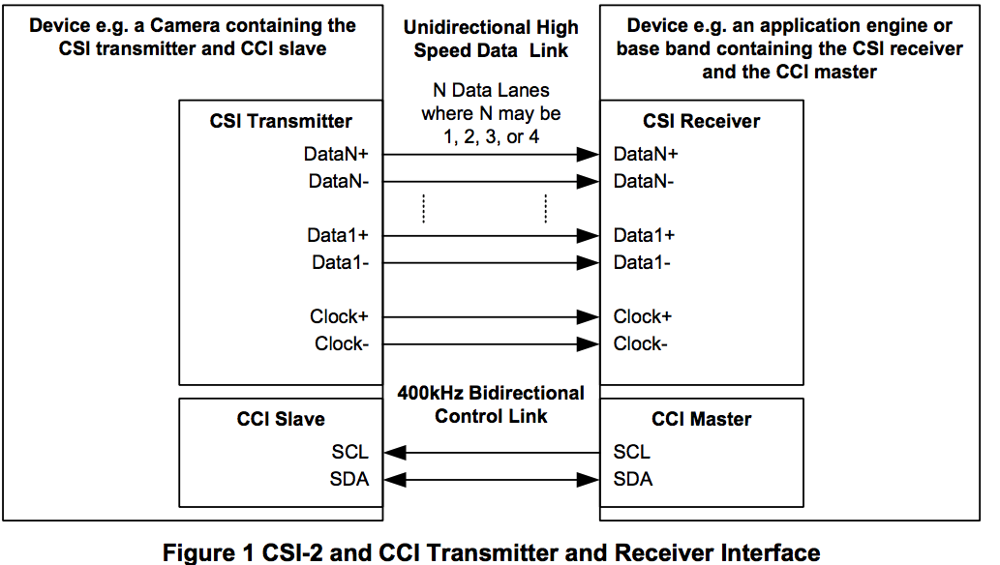
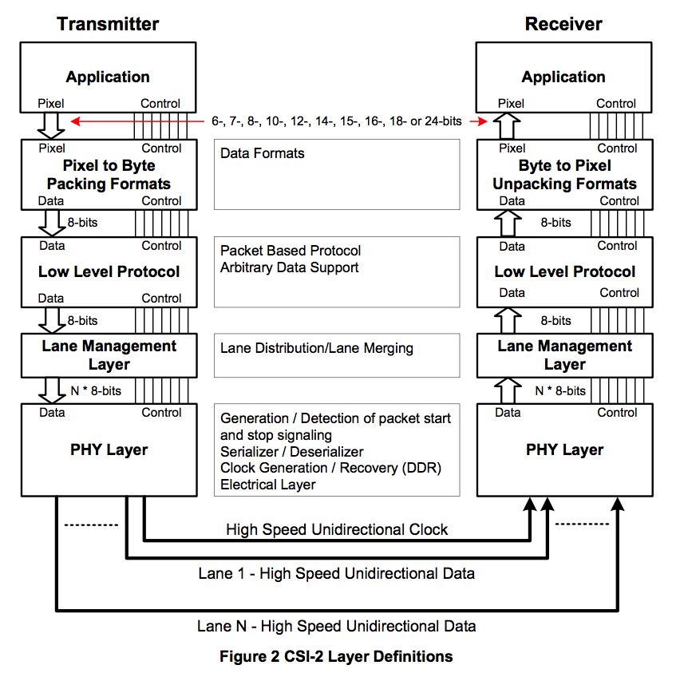
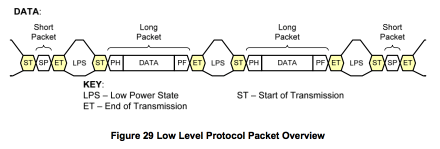
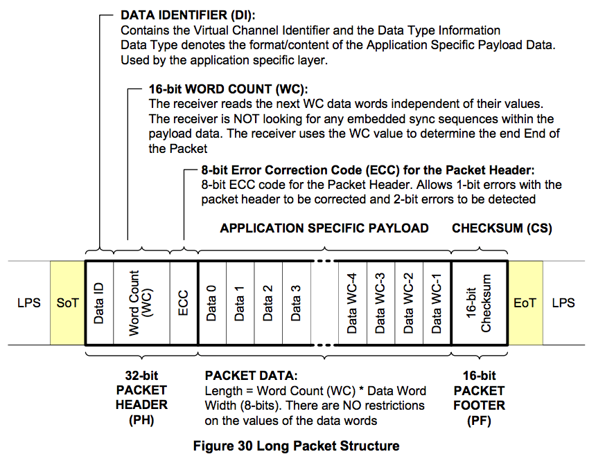
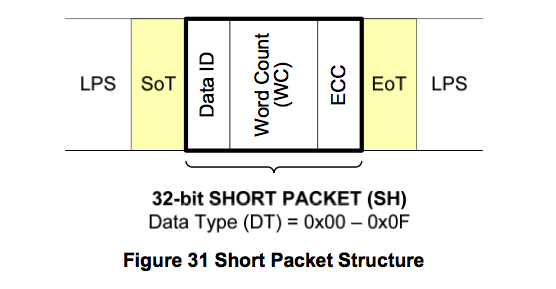
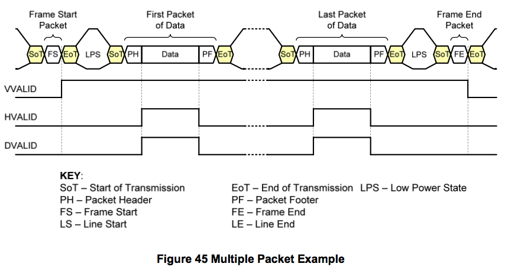
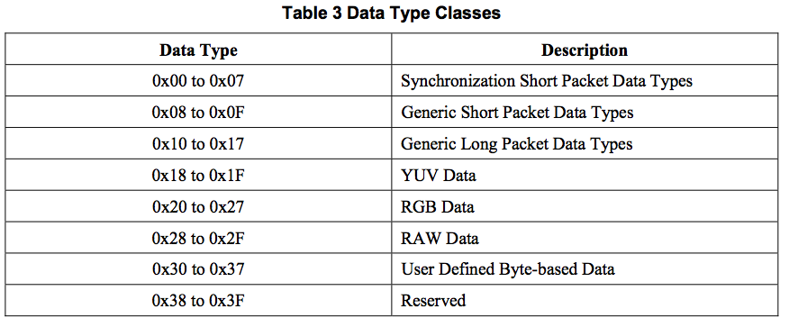
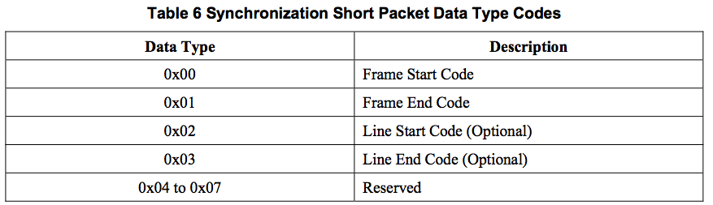

## CSI-2架构

- CSI2包含一个发送端transmitter和一个接收端receiver
    - 发送端和接收端可以有最多4路数据传输通道和1个clock通道
    - 每个lane（通道）包含2根物理连线
- CCI：一个I2C fastmode兼容协议，支持400K数据传输和7bit地址
- 一般transmitter作为CCI的slave，receiver作为CCI的master端

### 分层结构图

## 打包类型与结构

- 打包格式分为：长包和短包格式
- 长包格式：

- 短包格式：

- 包组合举例：

- DT类型表

## 数据传输

