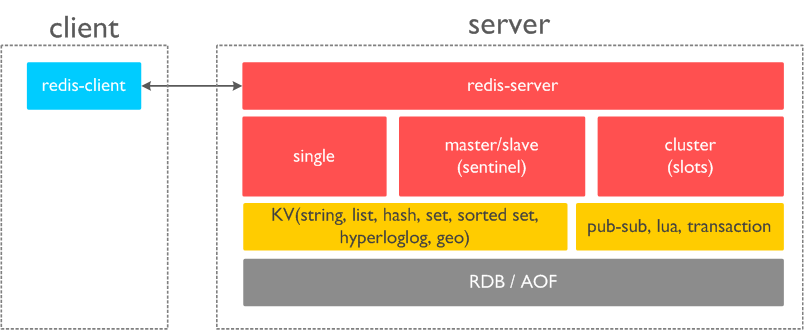

## architecture


- redis是一个典型的CS结构，客户端通过socket连接到服务器端，通过发送命令+接收响应的方式来与服务器端进行通讯
- redis服务器有三种运行方式
    * 单机方式
    * 主从方式：利用sentinel系统进行主从切换，从而提高系统可用性（HA）
    * 集群方式：主要解决单机内存有限的问题，对数据进行分布式存储，通过对key进行crc16运算得到数据所在的slot，并通过slot找到对应的服务器地址，进行获取数据
- redis是一个KV内存数据库
- 支持RDB和AOF两种数据持久化方式
    - RDB文件存放真实数据
    - AOF文件存放的是对数据库的有效写指令，然后基于这些写指令重建数据库


## 底层机制

### 数据存储
redis使用redis对象来存储键和值：键只有一种对象类型：字符串对象，值有多种对象类型，包括：

```
- REDIS_STRING： 字符串对象（INT, EMBSTR, RAW）
- REDIS_LIST：列表对象(ZIPLIST, LINKEDLIST)
- REDIS_HASH：哈希对象(ZIPLIST, HT)
- REDIS_SET：集合对象(INTSET, HT)
- REDIS_ZSET：有序集合对象(ZIPLIST, SKIPLIST)
```

可以使用`type $key`命令查看指定key的对象类型，使用`object encoding $key`查看key值对象的编码类型

对象内部的数据存储有多重编码方式：

```
- REDIS_ENCODING_INT
- REDIS_ENCODING_EMBSTR
- REDIS_ENCODING_RAW
- REDIS_ENCODING_HT
- REDIS_ENCODING_LINKEDLIST
- REDIS_ENCODING_ZIPLIST
- REDIS_ENCODING_INTSET
- REDIS_ENCODING_SKIPLIST（有序）
```

HT底层使用dict来进行存储：

- dict使用MurmurHash2对key值求hash，然后用计算出来的值与数组size做二进制与运算，得到数组index；
- 对于有冲突的key，使用链接地址法进行冲突解决。
- 使用渐进式rehash的方式对内存进行扩展和缩小；

redis服务器在单机模式下默认可以管理16个数据库，可以使用`select N`的方式切换数据库，但是在集群方式下只有0号数据库可用

### 客户端连接
在linux系统上，redis通过epool的方式监听socket，有以下几种socket

- 服务器accept socket：用于作为服务监听的socket接收客户端的连接请求
- 客户端通讯socket：有accept socket返回的用于和客户端通讯的socket，用于完成客户端的命令并返回结果

默认支持10000个客户端连接，TCP的backlog为512

redis服务器使用单进程和单线程的方式处理客户端请求


### 多机主从方式（sentinel系统）

- redis通过sentinel系统监控主从服务器，在主服务器已经确认为客观下线的情况下，由领头sentinel进行故障转移，在从服务器中选出一个作为主服务器接收客户端请求；
- 领头sentinel是通过raft协议的leader election选举得出来的
- 从服务器通过`slaveof $master_ip $port`命令设置为某个主服务器的副本服务器，也可以通过配置文件的方式指定主从关系以及sentinel监控的主从服务器信息
- 对于一个刚刚启动的没有任何数据的服务器，通过如下步骤进行数据同步处理
    - 主服务器发送rdb文件给从服务器
    - 主服务器将记录在命令缓冲区中的所有写指令发送给从服务器，从而同步到最新状态
- 客户端每次连接服务器的时候，先连接到sentinel系统，获取到主服务器的ip地址后，再连接到主服务器进行数据操作，这样可以保证每次都能获取到新的可用的服务器

参考

[sentinel示例](http://blog.csdn.net/u013086392/article/details/52830804)

### 多机集群方式

**背景**：redis集群为了解决单机内存不足和计算能力有限的问题，使用虚拟slot机制对数据进行分片，然后把多台redis master加入到不同的slot中，数据根据key使用crc16计算数据所在的slot，然后通过slot找到对应的主机，进而获取数据。

**客户端请求处理**：client连接到服务器，如果对应的数据不在当前连接的服务器上，服务器会返回moved错误，告知client数据所在的服务器的ip地址和端口号，cluster中的每台服务器中都包含所有各台服务器负责的slot信息。

**故障检测**：cluster中每个服务器通过PING命令来检测周围服务器的状态，如果没有收到PONG消息，则将对端节点置为PFAIL，然后通过错误报告进行扩散，如果集群中有超过一半的节点都认为该节点PFAIL，则将其下线。

**当故障迁移**：cluster中的一台服务器down机后，如果有slave服务器，则选举一个slave节点作为主服务器，并将之前指派给主服务器的所有slot指派给自己，然后接收客户端请求。


##install on macOS
```
brew install redis
```

## configuration
- 修改默认配置文件redis.conf

```
daemonize yes
requirepass yourpassword
dbfilename xxxx.rdb
dir /path/to/run

```

## run

```
redis-server /path/to/redis.conf
```

## reference

[http://www.redis.net.cn/](http://www.redis.net.cn/)

